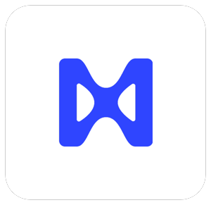

## Welcome to Matterize Labs

**Your trusted partner for developing certified Matter connected home devices.** We transform your innovative hardware concepts into production-ready, CSA-certified Matter devices with seamless integration across all major smart home ecosystems.

---
## Our Services

➜  **Custom Matter Firmware** - Optimized firmware for your hardware

➜  **DAC Partnership** - Direct CSA approval committee collaboration

➜  **Matter Certification Testing** - Full Matter certification testing (Partner Program) 

➜  **Smart Home Integration** - Apple Home, Google Home, Alexa, SmartThings support

➜  **Post-Launch Support** - Ongoing technical support

---
## Certified Devices

| Product | Manufacturer | Type | Connectivity | Certification |
|---------|--------------|------|--------------|---|
| **[Brighter Lamp](https://csa-iot.org/csa_product/brighter-lamp/)** | Brighter Lighting Inc. | Extended Color Light | WiFi, BLE | CSA25781MAT46803-24 (Sept 2025) |
| **[Dendo SCM Shade](https://www.csa-iot.org/csa_product/dendo-scm-shade)** | Dendo Systems Pty Ltd | Window Covering Controller | Thread, BLE | CSA2438EMAT43585-24 (July 2024) |
| **[Anablep Motion Sensor](https://www.csa-iot.org/csa_product/anablepsecurity-motion-sensor)** | Steadfast Technology LLC | Multi-Sensor (5-in-1) | WiFi, BLE | CSA25057MAT44969-24 (Jan 2025) |

All devices are TIS/TRP tested, Matter v1.2/v1.4 compliant, and certified for all major ecosystems.

---
## Why Matterize Labs

➜  Complete solution from concept to certification

➜  Official CSA partnerships for streamlined approval

➜  Proven TIS/TRP compliance track record

➜  Production-ready implementations

➜  Multi-platform ecosystem support

---
## Get Started

➜  [Schedule a consultation](https://cal.com/abu-matterize/matter-development) for your device idea
➜  We handle: firmware development, certification testing, production launch
➜  Ongoing post-launch technical support included

---
## Connect

➜  GitHub: [@matterizelabs](https://github.com/matterizelabs)

➜  Website: https://matterize.io

---
**
Matterize Labs - From Concept to Certified Matter Product. Making smart homes interoperable and less confusing, together.
**
